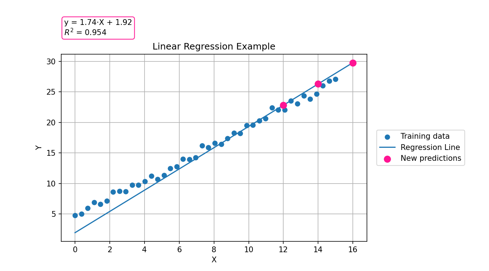
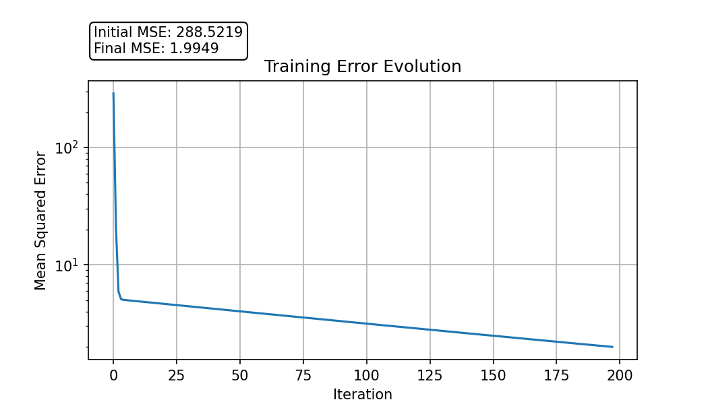

# Linear Regression with Gradient Descent

This project implements a Linear Regression model from scratch using Gradient Descent.

## Model Overview

The implemented model allows the user to:

Train a linear regression model using Gradient Descent
Define different stopping criteria:
  - maximum number of iterations
  - minimum error threshold
  - minimum improvement between iterations
Predict output values for new input data
Analyze training behaviour through the evolution of the error

## Example Application

An example application of the model is provided.

