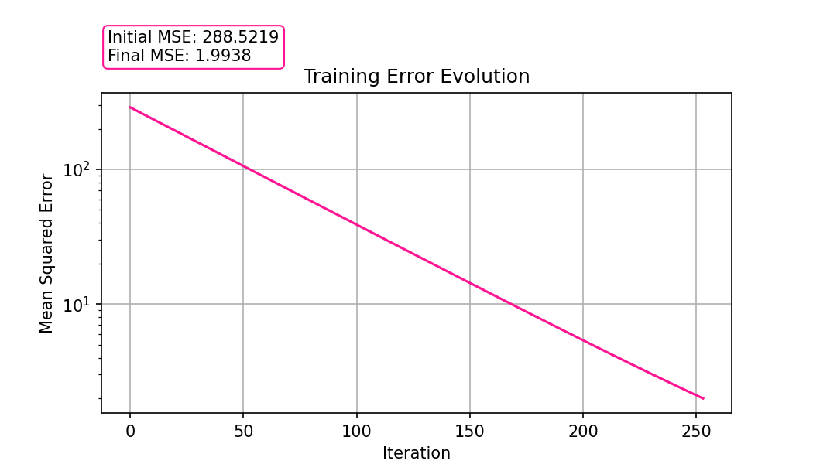
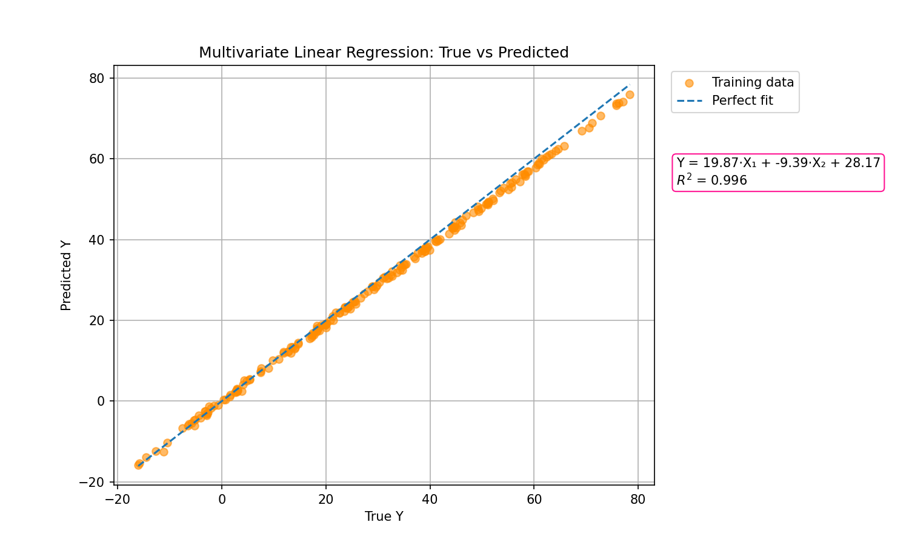
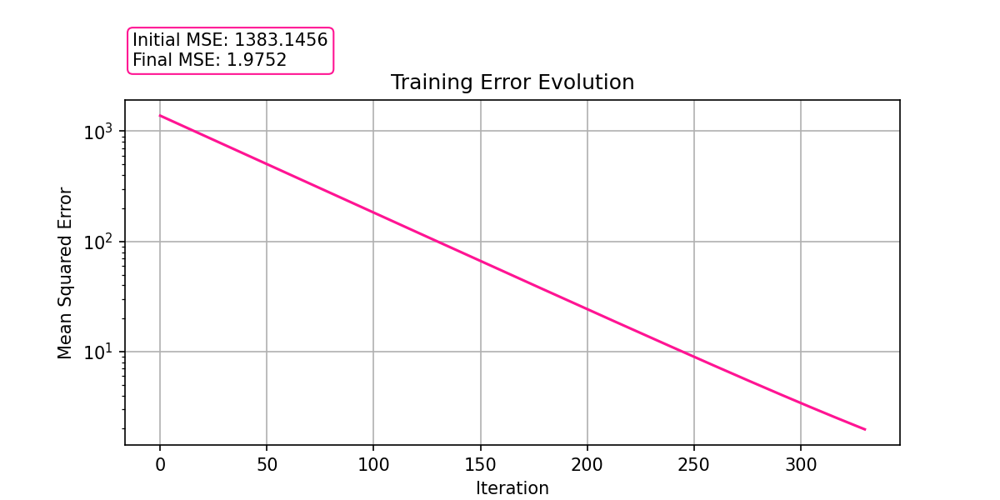

# Linear Regression with Gradient Descent
This project implements a Linear Regression model using Gradient Descent with configurable stopping criteria.

## Model Overview
### Optimization
- **Gradient Descent** is used to iteratively minimize the **Mean Squared Error (MSE)** loss function.

### Stopping Criteria
Training can stop based on one or more of the following conditions:
  - Maximum number of iterations
  - Minimum error threshold
  - Minimum improvement between iterations

### Features 
- Univariate and multivariate regression
- Internal feature scaling for numerical stability
- Model performance evaluation using **R² score**

---

## Parameters:
- `learning_rate`: Step size for gradient descent
- `n_iterations_max`: Maximum number of training iterations
- `tol` (optional): Stops if improvement < tol
- `min_loss` (optional): Stops if MSE < min_loss

## Attributes:
- `coef_`: Learned coefficients
- `intercept_`: Learned bias term
- `loss_history_`: MSE at each iteration
- `n_iter_`: Number of iterations performed
- `stop_reason_`: Reason why the training stopped

## Methods:
- `fit(X, y)`: Trains the model
- `predict(X)`: Makes predictions
- `score(X, y)`: Calculates the R squared score

---

## Installation
```bash
git clone https://github.com/yourusername/linear-regression.git
cd linear-regression
```
Requirements: `numpy`, `matplotlib` (for examples)

## Example Application
### Univariate Regression
This example demonstrates training the model on synthetic univariate data with noise, showcasing how the algorithm learns a linear relationship between a single feature and the target variable.


#### Training Convergence
The evolution of the training error illustrates the convergence behavior of gradient descent.



### Multivariate Regression
In the multivariate case, the model learns a linear relationship using multiple input features. As such, since a regression line cannot be visualized in higher dimensions, the model performance was illustrated by comparing true versus predicted values.


#### Training Convergence
The evolution of the training error illustrates the convergence behavior of gradient descent.



## Author
Inês David - Linear Regression Progamming Project